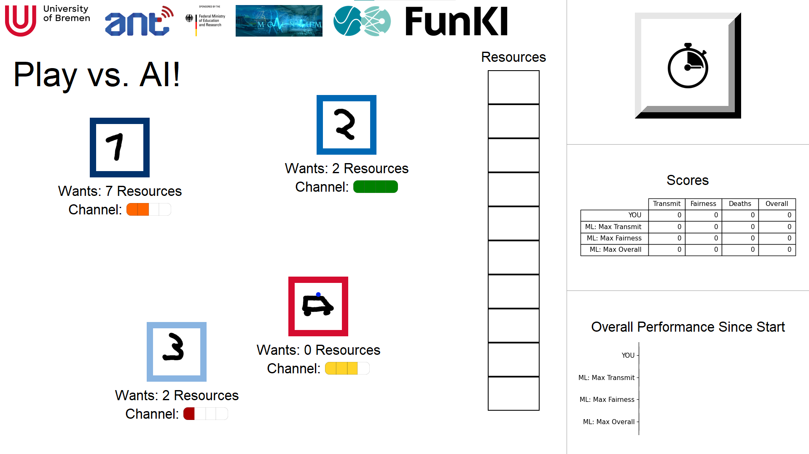

# Man vs Machine Resource Scheduling demo

The user can compare themselves to three AI algorithms in optimizing system metrics,
currently sum rate, fairness, ambulance timeouts, and mixed performance, by intelligent resource scheduling.
There is also a countdown challenge mode.

The relevant file to start the GUI demo is `src/analysis/gui.py`.
Most config parameters, e.g., UI scaling, are controlled in `src/config/config_gui.py`.  
Python3.10 is used for this project.



### How does it work?
- Users want x number of resources -> allocating more than that has no benefit
- Users have a channel strength -> One resource at better channel leads to more "throughput"
- Click on user icon to allocate one resource to this user
- When all resources are allocated, stats are calculated:
  - Throughput (roughly resources times channel strength)
  - Fairness (proportional)
  - Deaths (did ambulance get all required resources)
  - Overall (weighted sum of all other stats)
- Three AI schedulers are implemented for comparison: one tries to maximize throughput, one fairness, one overall.
- The right hand side features two tabs for results visualization: Allocations and Statistics
  - The Allocations tab features every schedulers' last allocation as well as the immediate scores achieved
  - The Statistics screen breaks down each scheduler's performance since the last reset
- Auto mode allocates at random, just so something is happening on screen.
- The first few situations after each reset can be rigged to always be deterministic


### Talking points:
- Resources can be, e.g., time or frequency blocks
- What is optimization criterion? Data Throughput? Fairness (How do we define that?)?
Special Objectives, e.g., ambulance traffic? Usually a mixed objective, depending on operator,
area (urban, non-urban, ...) -> Complex
- How does the Reinforcement Learned algorithm learn the relative importance of these factors? -> 
Trial and error, just like the player would when playing the demo
- You will notice: AI Algorithms are not trained to convergence, i.e., Max Fairness will not always find
the fairest allocation etc. This is not immediately obvious -> we must be mindful of that when applying AI
algorithms in practice
- You can sometimes see the Max Fairness algorithm not even allocate all of its resources and
still find a strong fairness score. It has found a way to game our performance metric definition.

### Most Important config in `config_gui.py`:
- Language setting via `self._strings_file`
- Font scaling via `global_font_scale`
- Partner Logos via `self.logos`

### Folder Structure:

```
root
|   .gitignore          | .gitignore
|   README.md           | this file
|   requirements.txt    | project dependencies
|           
+---models              | pre-trained models
+---reports             | related material
+---src                 | code
|   +---analysis        |   GUI related
|   +---config          |   configuration files
|   +---data            |   simulation related
|   +---models          |   learning related
```

### Known Issues:
- Fonts will look ugly when using conda. Does not build TrueType fonts (["Why not use something more modern than tk?"](https://github.com/ContinuumIO/anaconda-issues/issues/6833)). Bundling a font file does not seem feasible either.

## Quickstart
This project uses Python3.10.0.  
### Ubuntu / Linux
Under Ubuntu you can simply run the `init.sh` file, it will:
- add the deadsnakes/ppa to your system
- perform an apt update
- apt install 
- - software-properties-common
- - python3.10 python3.10-venv python3.10-pip

And then download and install the necessary python libraries into a virtual environment.

To start the demo, you can run the `start.sh`, it will:
- activate the venv created by `init.sh`
- run the `src/analysis/gui.py`

### Windows
Create and activate a python3.10 environment, to install depending libraries run:
`pip install -r requirements`  

Concerning the config files under `src/config/`: 
 The `*.py.default`-files wont be found, so either remove the `.default` or create your own config from our templates!
 
To start, run the following command from the projects root folder:  
`python src/analysis/gui.py`
